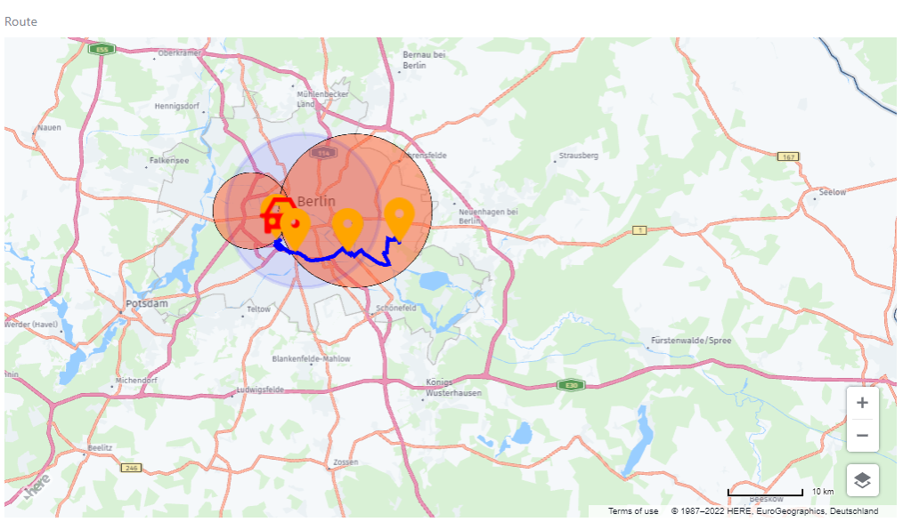

# Here Api Map Field

Here API map for Laravel Nova Field with the ability of real-time position update.

### Installation

composer require haythem/here-api-map-field

### Publish config

php artisan vendor:publish --provider="Haythem\HereApiMapField\FieldServiceProvider" --tag="config"

Here you can set up your api key.

## Usage

```php
        // NOVA RESOURCE
        use Haythem\HereApiMapField\HereApiMapField;

        public function fields(Request $request)
        {

            $points = [
                [
                    "id" => 1,
                    "lat" => "52.4698452",
                    "lng" => "13.3827823",
                    "description" => "Berlin 1",
                ],
                [
                    "id" => 2,
                    "lat" => "52.4818032",
                    "lng" => "13.3463453",
                    "description" => "Berlin 2",
                ],
                [
                    "id" => 3,
                    "lat" => "52.484911",
                    "lng" => "13.3529294",
                    "description" => "Berlin 3",
                    "svg" => '<svg fill="red" xmlns="http://www.w3.org/2000/svg" viewBox="0 0 20 20"><path d="M2 14v-3H1a1 1 0 0 1-1-1 1 1 0 0 1 1-1h1l4-7h8l4 7h1a1 1 0 0 1 1 1 1 1 0 0 1-1 1h-1v6a1 1 0 0 1-1 1h-1a1 1 0 0 1-1-1v-1H5v1a1 1 0 0 1-1 1H3a1 1 0 0 1-1-1v-3zm13.86-5L13 4H7L4.14 9h11.72zM5.5 14a1.5 1.5 0 1 0 0-3 1.5 1.5 0 0 0 0 3zm9 0a1.5 1.5 0 1 0 0-3 1.5 1.5 0 0 0 0 3z"/></svg>', // Optional
                    "show_marker" => true // Optional.
                ],

            $circles = [
                            [
                                "lat" => 52.5190146,
                                "lng" => 13.3979387,
                                "radius" => 10000,
                                "color" => "rgba(255, 87, 34, 0.5)", //oprional
                                "border_color" => "rgba(0,0,0,1)", //oprional
                                "border_width" => 1 //oprional
                            ],
                        ]


              return [

                        HereApiMapField::make('Route')
                        ->apikey('<API_KEY>') // Optional If you specify the api key in theconfig file "here-api-map-field.php" you don't need to add it herebecause it will override it.

                        ->addGpsPoints($points).// you can add markers in two ways you can pass an array of marker or/and chain it with addGpsPoint like the commented code below.

                        //->addGpsPoint(4, 52.4698452, 13.4827823)
                        //->addGpsPoint(5, 52.4818032, 13.5827823,'<svg></svg>',true)


                        ->autoRefreshPoints(route('update-positions'),5000)

                        ->addCircles($circles)
                        // Optional You can draw a circles with this functio,you can add circles in two ways you can pass an array of circle or/and chain it with addCircle like the commented code below.

                        //->addCircle(52.5190146, 13.4979387, 10000)
                        //->addCircle(52.5190146, 13.2979387, 5000)

                        ->setCenterAndZoom(52.4698452, 13.3827823, 12)
                        // Optional setinitial postion and zoom bydefault it will center at the first point with 14 zoom.

                        ->showInstructions()
                        // Optional show route instruction.

                        ->showDistance()
                        // Optional show route distance.

                        ->showTime()
                        // Optional show route estmated time.

                        ->routeParameter(),
                        // Optional setup route config default parameters as folow below:
                        /**
                         * $route_line_color = "blue" you can use rgba/hex also.
                         * $route_line_width = "5"
                         * $draw_route = true,
                         * $type = "fast", // mode
                         * $Transport_mode = "car",
                         * $Traffic_mode = "default"
                         *
                         * you can read about this option in the docs  https://developer.here.com/documentation/routing/dev_guide/topics/resource-calculate-route.html
                        */
              ];
        }


        // API ROUTE api.php No this only required if you want update the position frequently without refreshing the map page.

        Route::get("update-positions", function () {

          $points = [
              [
                  "id" => 1,
                  "lat" => "52.469" . rand(1, 9) . "452",
                  "lng" => "13.382" . rand(1, 9) . "823",
              ],

              [
                  "id" => 2,
                  "lat" => "52.48" . rand(1, 9) . "8032",
                  "lng" => "13.346" . rand(1, 9) . "453",
              ],

              [
                  "id" => 3,
                  "lat" => "52.48" . rand(1, 9) . "911",
                  "lng" => "13.35" . rand(1, 9) . "9294",
              ],

          ];
          return response()->json($points, 200);
      })->name('update-positions');


```

## Screenshot





